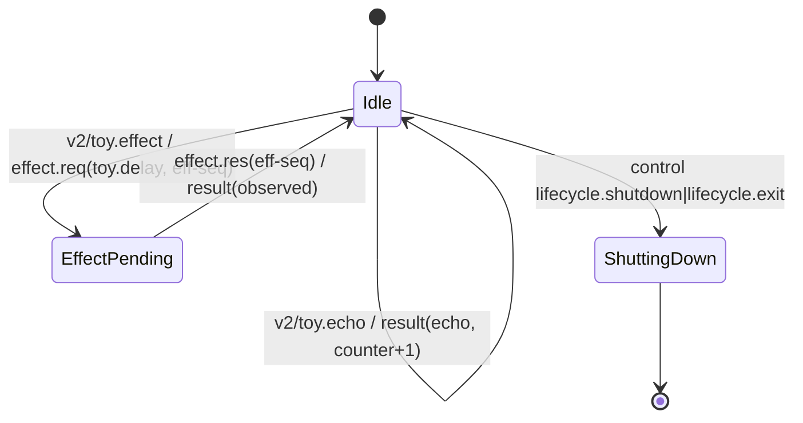

<!-- GENERATED by Microsoft.SqlTools.Sts2.Testing.GeneratedDocs; do not edit by hand. Regenerate: ./scripts/update-sts2-docs.ps1 -->
# STS2 State Machines

The query machine lands in M3. The M1 toy machine proves the coordinator/journal/replay loop and is removed before preview.

## Connection machine (M2)

One entry per connection in `CoreState.Connections`; `openId` is indexed while an open is in flight.

```mermaid
stateDiagram-v2
    [*] --> Opening : v2/connection.open / effect driver.open (openId indexed)
    Opening --> Open : effect.res ok / result(connectionId, serverInfo); openId released
    Opening --> [*] : effect.res error / error(Sts2.ConnectionFailed.*)
    Opening --> [*] : effect.res canceled / error(Sts2.Canceled)
    Opening --> Opening : v2/connection.cancel / result {} + effect driver.cancelOpen (CancelRequested)
    Opening --> Opening : v2/connection.close / result {} + effect driver.cancelOpen
    Open --> Closing : v2/connection.close / effect driver.close
    Closing --> [*] : effect.res / result {}
    Closing --> Closing : v2/connection.close / result {} (idempotent)
```

Unknown ids on cancel/close return `{}` (idempotent, SPEC §7.9). A duplicate in-flight `openId` fails with `Sts2.InvalidRequest`; the `maxConnections` limit fails with `Sts2.Busy`.

## Toy machine (M1)

Unknown requests produce `Sts2.InvalidRequest`; malformed envelopes produce `core.unexpectedInput` diagnostics. The reducer never throws (SPEC §9.2).
