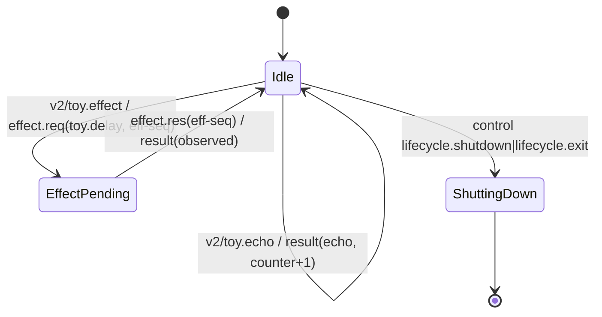

<!-- GENERATED by Microsoft.SqlTools.Sts2.Testing.GeneratedDocs; do not edit by hand. Regenerate: ./scripts/update-sts2-docs.ps1 -->
# STS2 State Machines

Connection and query state machines land with their verticals (M2/M3). The M1 toy machine proves the coordinator/journal/replay loop and is removed before preview.

## Toy machine (M1)

Unknown requests produce `Sts2.InvalidRequest`; malformed envelopes produce `core.unexpectedInput` diagnostics. The reducer never throws (SPEC §9.2).
