<!-- GENERATED by Microsoft.SqlTools.Sts2.Testing.GeneratedDocs; do not edit by hand. Regenerate: ./scripts/update-sts2-docs.ps1 -->
# STS2 State Machines

The connection and query machines are live. The M1 toy machine was removed in M3.

## Connection machine (M2)

One entry per connection in `CoreState.Connections`; `openId` is indexed while an open is in flight.

```mermaid
stateDiagram-v2
    [*] --> Opening : v2/connection.open / effect driver.open (openId indexed)
    Opening --> Open : effect.res ok / result(connectionId, serverInfo); openId released
    Opening --> [*] : effect.res error / error(Sts2.ConnectionFailed.*)
    Opening --> [*] : effect.res canceled / error(Sts2.Canceled)
    Opening --> Opening : v2/connection.cancel / result {} + effect driver.cancelOpen (CancelRequested)
    Opening --> Opening : v2/connection.close / result {} + effect driver.cancelOpen
    Open --> Closing : v2/connection.close / effect driver.close
    Closing --> [*] : effect.res / result {}
    Closing --> Closing : v2/connection.close / result {} (idempotent)
```

Unknown ids on cancel/close return `{}` (idempotent, SPEC §7.9). A duplicate in-flight `openId` fails with `Sts2.InvalidRequest`; the `maxConnections` limit fails with `Sts2.Busy`.

## Query machine (M3)

One entry per query in `CoreState.Queries`; one active query per connection (`Sts2.Busy` otherwise). Backpressure: Core grants page credit via `driver.queryAdvance`; the runner's enumerator pull blocks without credit (SPEC §7.8, I9).

```mermaid
stateDiagram-v2
    [*] --> Running : v2/query.execute / result(queryId) + effect driver.queryStart(credit)
    Running --> Running : queryEvent rows / notify query.rows (pagesSent+1, credit-1)
    Running --> Running : queryEvent resultSet|message / notify
    Running --> Running : v2/query.ack / effect driver.queryAdvance(newCredit)
    Running --> CancelRequested : v2/query.cancel / result {} + effect driver.queryCancel
    Running --> Completed : queryEvent completed|error / notify query.complete (exactly once, I2)
    CancelRequested --> Completed : queryEvent canceled|completed|error / notify query.complete
    Running --> Disposing : v2/query.dispose / result {} + effect driver.queryDispose (connection held, events suppressed)
    CancelRequested --> Disposing : v2/query.dispose / result {} + effect driver.queryDispose
    Disposing --> Disposed : driver.queryDispose result (pump stopped) / notify query.complete(status=disposed) — exactly one terminal (I2, D-0011)
    Disposing --> Disposing : v2/query.cancel / result {} (idempotent — dispose supersedes cancel; must NOT regress to CancelRequested or the dispose ack is dropped, seed 7496)
    Completed --> Disposed : v2/query.dispose / result {} (terminal already sent)
    Disposed --> [*]
```

`connection.close` with an active query cancels the query first; the connection closes when the query reaches a terminal state (SPEC §7.9).

Unknown requests produce `Sts2.InvalidRequest`; malformed envelopes produce `core.unexpectedInput` diagnostics. The reducer never throws (SPEC §9.2).
